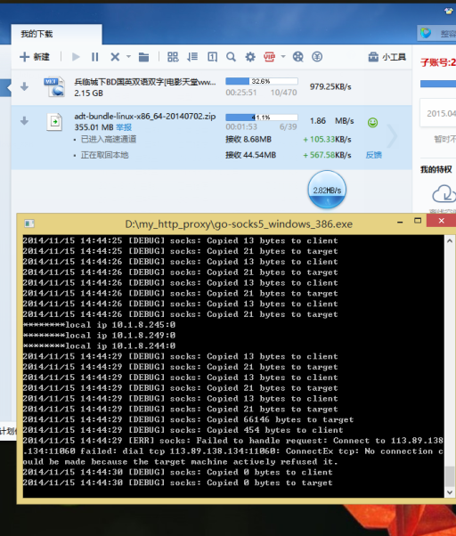

go-multi-IP-acceleration
========================
####go-multi-IP-acceleration是用golang实现的一个socks5代理，它可以把流量随机从多个本地IP发出，在某些网络环境下可以达到加速网络的效果

###原理简介：
先看下宽带用户中流行的[双拨/多拨](http://member.mcplive.cn/space.php?uid=1799&do=thread&id=30167)
> 什么是双拨/多拨呢？就是两台甚至多台设备同时用同一个账号，在同一条线路上拨号，如果能够同时拨通，就称为双拨/多拨。
为什么要双拨/多拨？因为有些地区的ISP运营商，可能没有完全在线路端口上面限速，限速的只是账号，那么双拨/多拨以后，你每台设备都能达到账号限速的带宽，如果能够叠加起来，你就等于免费拥有了2倍甚至N倍的带宽，想想看，2倍甚至N倍的网速，是不是很吸引人？

在我们实验室的校园网中(类似与很多公司的内网),主干路由器限速是根据IP来的，我们同样可以使用openwrt路由器的nwan功能虚拟多张网卡实现带宽叠加。

但是实际上，因为免去了拨号过程，我们完全没有必要使用多张虚拟网卡，我们只需要多个IP就足够了。而同一个网卡实际上是可以绑定多个IP的。
这样实现技术就很简单的，我们手动分配多个IP，然后把流量随机从不同的IP发出去即可。

要实现这样的流量分配，我们可以使用iptables。但是这样的话流量分配策略受iptables功能限制，很不灵活，而且不只能自己本机使用。
于是参考大多数翻墙工具的做法，我们实现一个HTTP代理/Socks5代理,然后在代理端建立的时候指定出口IP即可。

这里的实现是一个Socks5代理

效果如下，使用之前下载速度100-280KB/s，使用之后可达2-3MB/s:

###使用说明：
- 下载golang开发环境，然后编译对应平台的二进文件,也可以直接从release中下载。
- 用nmap等工具扫描出一个空余IP列表
- 然后在本地机器加上多个IP,(windows在设置IP的对话框选择高级，然后加上多个IP)，linux自己搜索相关资料。
- 然后把goproxy.ini放到和二进制文件一个目录，并修改配置文件
配置文件：
- port 为http代理功能保留，暂空
- port_socks5 代表监听端口
- local ip 本机IP地址列表
- allowed ip 允许使用代理的IP列表，暂未实现

然后运行， 打开迅雷，进入设置->高级设置->代理设置，然后添加代理，服务器 127.0.0.1， 端口和port_socks5一致，类型socks5，点测试，如果成功的话就ok了。建议把任务默认属性->原始地线程数调到10

TODO：
- 身份验证
- http代理
- 自动翻墙
- 自动检测IP冲突

特别感谢：https://github.com/armon/go-socks5
